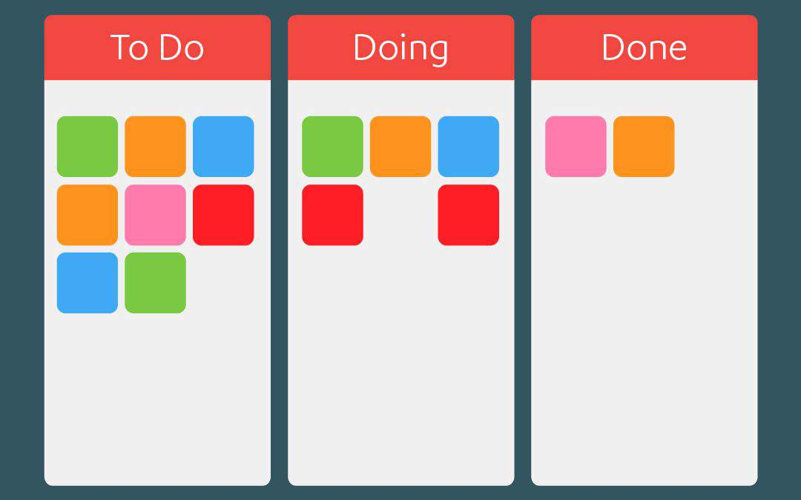

# Kanban React

Bravo ! Si tu es là, c'est que tu as retenu notre attention ! On aimerait maintenant voir comment cela se passe avec un exercice pratique.
Bonne chance !

## But de l'exercice

Développer une application qui permet de gérer un kanban. Pour rappel, il s'agit d'un tableau pour le suivi de tâches à réaliser. Chacune des colonnes correspondant à un statut possible, __Todo - Doing - Done__ dans notre cas:

Si plus d'explications sont nécessaires, n'hésite pas à demander.

### Que dois-je faire concrètement ?
Rassure-toi tout de suite : le kanban ne sera pas fini en 1h :)   
Le but est donc d'identifier et d'implémenter les fonctionnalités que tu juges les plus importantes pour démarrer. 
Sachant que de nombreuses choses peuvent être imaginées : gérer les priorités, affecter un ou des membres à une tâche, changer le statut d'une tâche, mettre une étiquette, gérer les limites WIP...  

Pour t'aider un peu, voici les 2 premières choses à faire :
- Mettre en place du routing pour que l'application soit atteignable à l'addresse http://localhost:3000/kanban.
- Afficher une première colonne avec une tâche.

Produis le code comme si tu le faisais "en vrai", sauf qu'on se concentre sur le code métier : pas besoin de gérer les logs, appels à un back, sécurité...

### Que faire si j'ai oublié la syntaxe ?
Pour information, tu as le droit d'utiliser tous les outils que tu veux : Documentation en ligne, StackOverflow, Google... fais en bon usage.

## Prérequis
Node 14 et npm 6.

# Getting Started with Create React App

This project was bootstrapped with [Create React App](https://github.com/facebook/create-react-app).